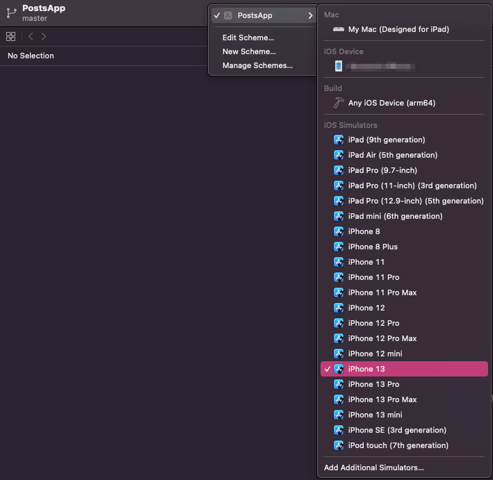

# Zemoga Mobile Test

After forking and cloning this project, open a terminal in the project folder and install Pods:

``` Swift
pod install
```

*We'll need CocoaPods installed for this part.*

Once Pods are installed, go to the project folder and open the `PostsApp.xcworkspace` file, this will open Xcode where we can set the device or simulator we wish to run the app on



and press the play button to build the app (or press `cmd + R`)

